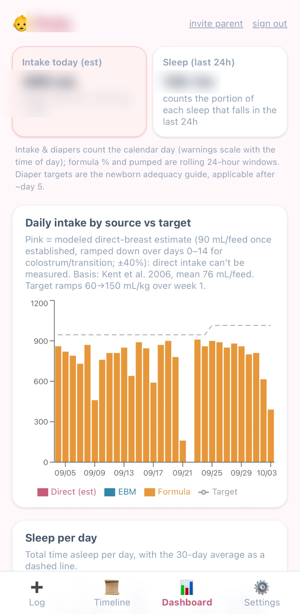
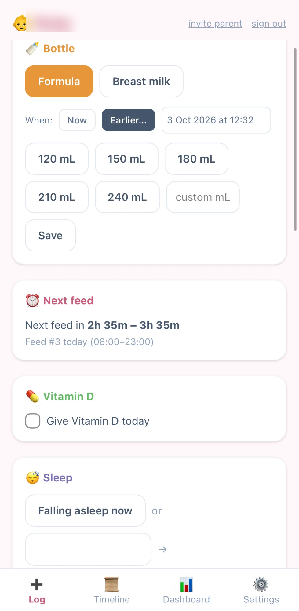
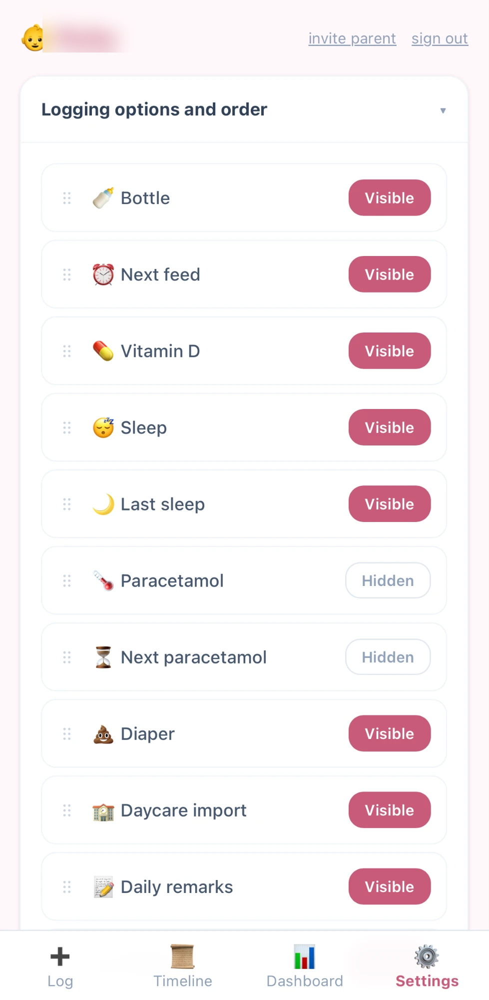
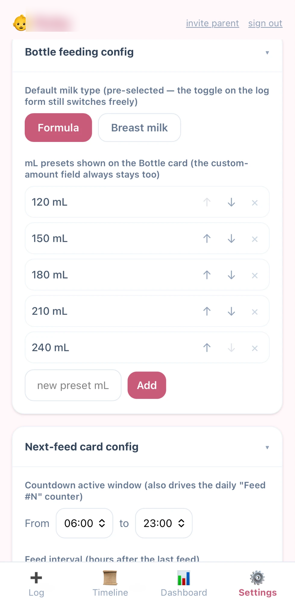
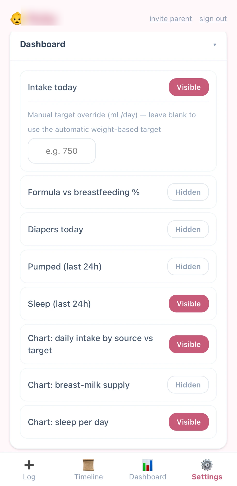

# Baby Tracker

A private, self-hosted baby-tracking web app for two or more caregivers on separate
phones with realtime sync. Log feeds, pumping, sleep, diapers, medication and
growth; see a dashboard with intake vs. a weight-scaled target, formula share,
breast-milk supply, sleep and diaper adequacy.

Installs to the home screen as a progressive web app (PWA), runs free on Supabase +
Vercel, and every family's data stays in **their own** Supabase project.

<p>
  
  
  
</p>
<p>
  
  
</p>

## Why it exists

Most trackers model a feed as a single "type", which loses information. This app
keeps feeds on **two independent axes**:

- **Delivery** — direct at the breast vs. bottle
- **Substance** — expressed breast milk vs. formula

A bottle of expressed milk shares its *substance* with a direct latch but its
*delivery* with formula. Keeping these separate is what makes the KPIs (formula
share, supply vs. demand, direct-vs-bottle balance) meaningful.

## Features

- Multi-caregiver access with realtime sync (Supabase Realtime + row-level
  security) — link a partner, grandparent, or anyone else to the baby by
  their email once they've signed up (this doesn't send them anything;
  they need to create their own account first — see setup step 2)
- **Settings tab**, per baby: show/hide and drag-reorder every log item, set
  bottle defaults/presets, tune the next-feed interval window, configure how
  many paracetamol doses are allowed per day, and toggle each Dashboard card
- Quick-add for:
  - Bottle and direct breastfeed (with a per-side nursing timer)
  - Pump (L/R), diaper, sleep (including a backdated "asleep now" start with
    no end time yet), and weigh-ins
  - **Vitamin D** — a shared daily checkbox, resets at the device's local midnight
  - **Paracetamol** — logs a timestamped dose, warns if it's given sooner than
    a fixed 4h gap, and a companion "Next paracetamol" card computes the
    earliest next dose under that same 4h floor plus a rolling-24h dose count
    against your configured daily limit (see *Design decisions & known
    limitations* below — the 4h figure isn't sourced medical guidance)
  - **Daily remarks** — a shared, dated journal both caregivers can write to
  - **Daycare import** — a batch-entry card for a daycare's end-of-day
    summary; type rows manually, or upload/paste a screenshot and an AI call
    pre-fills the rows for you to review before saving (the parsing prompt is
    tuned to one specific Dutch daycare app's "Dagritme" format out of the
    box — see setup step 5 to adapt it to yours)
  - All of the above are retroactively loggable
- **Dashboard**: daily intake by source vs. a weight-scaled target
  (~150 mL/kg/day, ramped up over the first week — see limitations below),
  formula % (today / 7-day / all-time), breast-milk supply (direct estimate +
  pumped L/R), rolling-24h diaper adequacy, sleep (24h and a "last sleep"
  card), plus charts for intake vs. target, supply, and a sleep-per-day chart
  with a rolling average line
- **Timeline**: a filterable (chips reflect what's visible in Settings),
  editable, deletable log of every entry — nothing you log is permanent if
  you made a mistake
- Optional: import history from a previous tracker's CSV export

> **Not medical advice.** Estimates (especially direct-breast intake, which
> can't be measured) are modeled, not measured, and the paracetamol tracker is
> a reminder/logging tool, not a dosing calculator — always follow your
> product's label or your pediatrician's guidance for actual dose amounts and
> timing. Weight checks with your pediatrician remain the source of truth.

## Security model

- Every data table (feeds, pumps, diapers, sleeps, growth, settings, daily
  remarks, Vitamin D, paracetamol) is gated by Postgres row-level security on
  `is_caregiver(child_id)` — a caregiver is anyone explicitly added to a
  child's `caregivers` row, either automatically (whoever creates the baby
  record) or via an invite by email from an existing caregiver.
- Anyone who signs up **can** create their own `children` row — that's by
  design, so you don't need an admin to onboard a new family — but doing so
  only makes them a caregiver of *that new, empty record*. RLS means they can
  never read or write a child they weren't explicitly invited to; there's no
  "public" or anonymous read path to any family's data.
- For a genuinely private, invite-only deployment, turn off public sign-ups
  in Supabase once everyone's created their account (see setup step 2).
- **If you leave sign-ups open**, know what that does and doesn't protect:
  `api/parse-daycare.ts` (the AI import) only checks that the caller is *a*
  caregiver of *some* child — and since anyone can create their own empty
  one, that check alone doesn't prove they're a real family member, not a
  stranger who just signed up to use your Anthropic key for free. What
  actually bounds that is a server-side daily call limit per account
  (`DAILY_LIMIT` in `api/parse-daycare.ts`, backed by
  `bump_daycare_import_usage()` in `schema.sql`) plus the image size cap
  (5MB) and the low `max_tokens`; your Anthropic account's own monthly spend
  cap (setup step 5.2) is the last-resort backstop, not the primary one.
  The full image is sent to Anthropic (model `claude-haiku-4-5-20251001`)
  for parsing — only sleep/feed rows are extracted from its response, but
  the image itself isn't filtered before it's sent. If you're not
  comfortable with a daycare screenshot leaving your Supabase project, skip
  that setup step; the manual row-entry form works standalone.
- `merge_duplicate_child()` (see *Design decisions* below) is a
  database-admin maintenance tool, not an app feature, and is deliberately
  **not** reachable through the app's API: Postgres grants `EXECUTE` on every
  new function to `PUBLIC` by default (unlike tables), so `schema.sql`
  explicitly revokes it back off and never re-grants it to
  anon/authenticated/service_role. Verified by calling it as an ordinary
  database role against a scratch database and confirming Postgres itself
  refuses with "permission denied for function" before the function body
  ever runs — and, separately, that the Supabase SQL Editor's own role can
  still call it and that it correctly migrates data and carries caregiver
  access forward. (An earlier version tried to allow it instead, gated on an
  in-function check of which role was calling — that was actually a no-op
  for every caller due to a SECURITY DEFINER subtlety, caught only by
  invoking it, not by reading the SQL; revoking the grant outright is both
  simpler and verifiable.)

## Design decisions & known limitations

- **Paracetamol's 4h minimum gap is a fixed constant in the code**
  (`PARACETAMOL_MIN_GAP_H` in `src/lib/settings.ts`), not configurable
  through the UI like the daily-dose-count limit is. It's a conservative
  floor, not sourced medical guidance — actual safe intervals depend on the
  product and the baby's age/weight, so treat the warning (and the "Next
  paracetamol" card's countdown) as a reminder to check, not as dosing
  advice from the app.
- **The 150 mL/kg/day intake target** is a common rule of thumb for young
  infants, already ramped from 60→150 mL/kg over the first week
  (`src/lib/types.ts`) rather than applied flatly from day one, and is
  overridable per baby in Settings → Dashboard (manual target override) for
  when it stops fitting as the baby grows.
- **`schema.sql`'s idempotency is real but scoped** — verified by actually
  running the file three times in a row against a scratch Postgres database
  (not just reasoning about the SQL) and hitting zero errors each time,
  including the specific upgrade case of an existing `baby_settings` table
  from before `paracetamol_doses_per_day` existed. What that covers: every
  `CREATE TABLE`/`TYPE`/`INDEX` is `IF NOT EXISTS`, every policy is dropped
  and recreated (Postgres has no `CREATE OR REPLACE POLICY`), and a small
  `ensure_realtime()` helper guards `ALTER PUBLICATION ... ADD TABLE`, which
  otherwise errors on a table already published — that one only surfaces on
  a second run, so it's exactly the kind of gap "I re-read the SQL and it
  looked fine" would have missed. What it does **not** cover: a column added
  to an *existing* table only counts if there's an explicit
  `ADD COLUMN IF NOT EXISTS` for it, like `baby_settings.paracetamol_doses_per_day`
  has — a future column added without one won't retroactively appear on an
  upgrade. There's no formal migration system beyond that.
- **Duplicate baby records** can happen because the app never auto-creates
  one, but nothing stops two caregivers from each tapping "create" before
  inviting each other — they end up with two separate records for the same
  baby, logging and viewing can land on different ones, and data appears to
  vanish. The app warns you when it sees more than one. Fix it from the SQL
  Editor with `select merge_duplicate_child('KEEP-uuid', 'DROP-uuid');` —
  it's kept in sync with every table that has a `child_id`, runs as one
  transaction, and re-attaches any caregiver who was only invited to the
  record being dropped (a hand-written `UPDATE` list wouldn't; that caregiver
  would silently lose access to the baby entirely).

## Tech

Vite + React + TypeScript, Tailwind, Recharts, `vite-plugin-pwa`,
`@dnd-kit` (Settings drag-reorder); Supabase (Postgres + Auth + Realtime)
backend; deploys on Vercel. The optional daycare screenshot parser
(`api/parse-daycare.ts`) is a Vercel serverless function calling the
Anthropic API.

## Self-host it

You need free **Supabase** and **Vercel** accounts, and Node 20+.

### 1. Supabase

1. Create a project at supabase.com.
2. **SQL Editor → New query** → paste all of [`supabase/schema.sql`](supabase/schema.sql) → run.
   This creates every table, row-level security policy, the caregiver model,
   and realtime — one run sets up the whole app (see *Design decisions* below
   for exactly what re-running it later after a fork update does and doesn't pick up).
3. **Authentication → Sign In / Providers → Email**: leave sign-ups on for
   now — everyone needs to create an account first (step 2 below turns this
   off once they have). If it's just you and people you already know and
   trust, you can also turn off "Confirm email" here, since there's no one
   else's identity to verify.
4. **Project Settings → API**: copy the Project URL and the publishable (anon)
   key.

### 2. Run locally

```bash
cp .env.example .env.local     # fill in VITE_SUPABASE_URL + VITE_SUPABASE_ANON_KEY
npm install
npm run dev
```

Sign up. The **first** caregiver fills in the baby's name / DOB / birth weight
once. Anyone else signs up, then the first caregiver opens **Caregivers** at
the bottom of the Log tab and invites them by email — this links both
accounts to the one baby. Don't create a second baby record (see *Duplicate
baby records* under *Design decisions & known limitations* below).

Once everyone who needs an account has one, go back to Supabase →
Authentication → Sign In / Providers → Email and turn **off** "Allow new
users to sign up" for an invite-only deployment (see *Security model* above
for exactly what this does and doesn't protect against). To add a new
caregiver later — a new grandparent, say — turn it back on, have them sign
up, invite them, then turn it back off.

`npm run dev` is plain Vite — it doesn't serve the `/api` serverless
functions, so the AI daycare-screenshot import (step 5 below) only works
once deployed to Vercel, not locally. The manual row-entry form works either way.

### 3. Deploy

Push to GitHub, import the repo in Vercel (framework auto-detects Vite), add the
two `VITE_*` environment variables, and deploy. On each phone, open the URL and
**Add to Home Screen** (iOS Safari) / **Install app** (Android Chrome) for the
standalone PWA.

If you left "Confirm email" on in step 1.3, also update Supabase →
Authentication → URL Configuration → Site URL to your Vercel URL — it
defaults to `localhost`, which is where confirmation/invite email links
would otherwise point after you deploy.

### 4. Optional — import history from a CSV

This was written against one specific previous tracker's export format (see
the column parser in [`src/lib/csv-import.ts`](src/lib/csv-import.ts)) — if
yours differs, adapt that file first. Then set two things in
`.env.local`: `SUPABASE_SERVICE_ROLE_KEY` (Supabase → Project Settings → API,
same page as the anon key from step 1.4, further down) and `CHILD_ID` (the
baby's `id` from the `children` table — every imported row attaches to this
one baby). Then:

```bash
# dry run — parses and prints a daily summary, writes nothing
npm run import:dry -- "path/to/export.csv"
# apply
npm run import -- "path/to/export.csv" --apply
```

Timestamps in these exports are local wall-clock with no timezone, so run the
import on a machine set to the timezone the log was recorded in. Imports are
idempotent — re-running on an overlapping export only adds new rows.

### 5. Optional — AI daycare screenshot import

The "🏫 Daycare import" card can pre-fill its sleep/feed rows from a photo of
your daycare app's daily summary, via `api/parse-daycare.ts` (see *Security
model* above for what this endpoint does and doesn't expose). Without this
step the card still works fine as a manual row-entry form — this just adds
the upload/paste shortcut.

1. Get an API key from console.anthropic.com. You'll need to fund the account
   (a small prepaid minimum) before a key actually works — usage itself is a
   fraction of a cent per screenshot, well under that.
2. Set a hard monthly spend cap on the key in the Anthropic console — see
   *Security model* above for what actually bounds cost day-to-day and why
   this cap is the backstop, not the primary protection.
3. In Vercel → Settings → Environment Variables, add `ANTHROPIC_API_KEY`
   (server-only — **no** `VITE_` prefix) and redeploy.
4. The prompt in `api/parse-daycare.ts` is tuned to one specific daycare
   app's "Dagritme" summary format — edit its "Conventions" section to match
   yours.
5. On the Daycare import card, either tap the upload button or just paste a
   screenshot from your clipboard (Cmd/Ctrl+V) directly into the card.

## Credits & forking

Forked from [MaxHasan/ai-tracker-app](https://github.com/MaxHasan/ai-tracker-app)
— credit to Max for the original two-axis feed model and dashboard. This fork
adds the Settings tab, Vitamin D and paracetamol dose tracking, the daily
remarks journal, AI-assisted daycare-screenshot import, and the fully
editable Timeline.

This is itself a fork, and you're welcome to fork it in turn — it's just a
self-hosted app with no shared backend, so every fork runs entirely on its
own free Supabase + Vercel + (optional) Anthropic account.

## License

MIT — see [LICENSE](LICENSE). Original work Copyright (c) 2026 Max Hasan;
later additions in this fork Copyright (c) 2026 Imre Scheffers.
